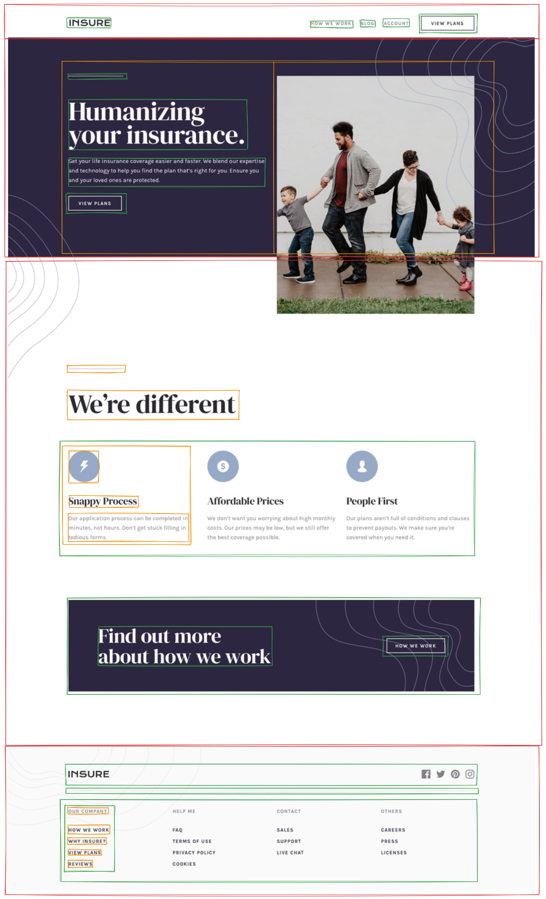
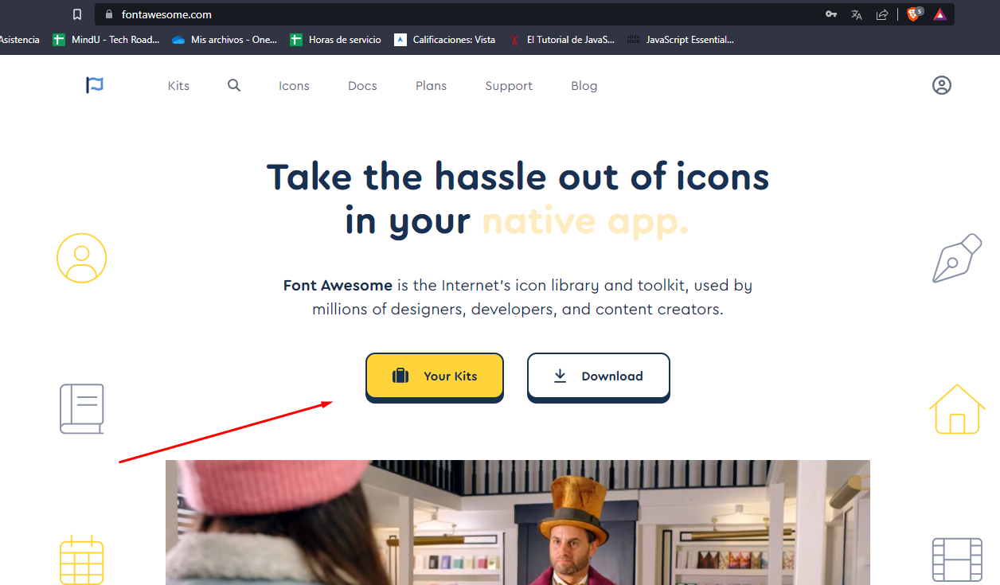
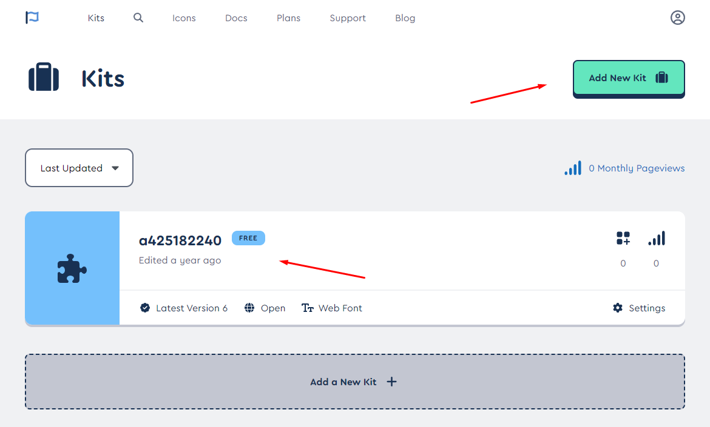
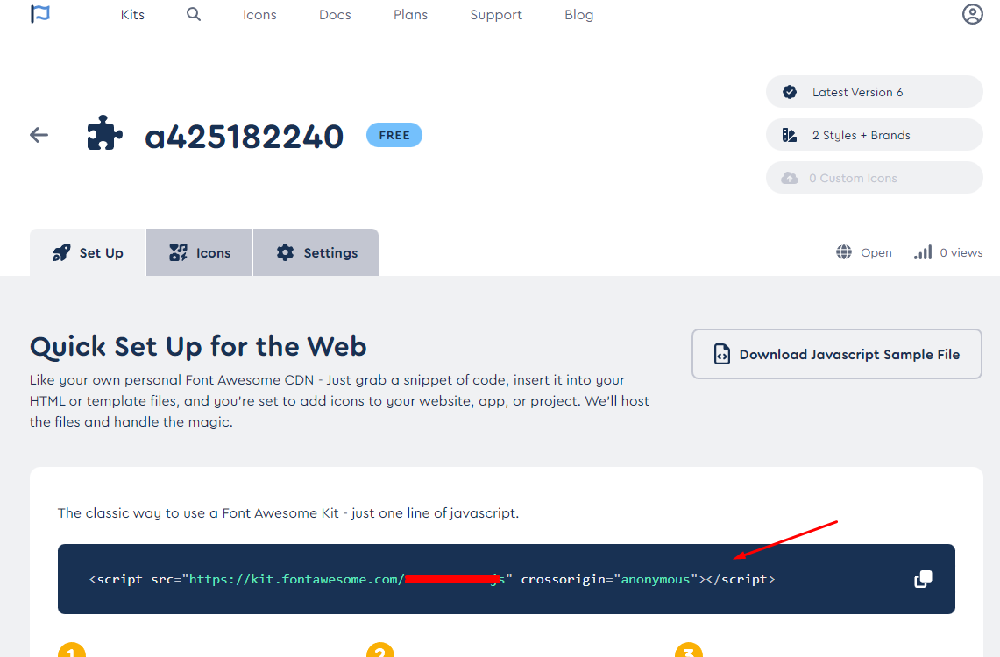

# Instrucciones

Bienvenido al MiniProyecto del nivel 1. En este proyecto estaremos aplicando los conocimientos adquiridos durante esta primera y segunda semana. Sigue las instrucciones de este archivo para completar el proyecto y ten en cuenta que estas mismas instrucciones se tomarán en cuenta para la evaluación del proyecto.

## Instrucciones generales

La empresa **Insure** desea crear una landing page donde sus clientes puedan conocer un po0co más de ellos. El diseño de la página web ya está terminado y ahora necesita que lleves a codigo este proyecto. Por suerte, ya tienes una base de código que puedes utilizar para comenzar a trabajar. Según las instrucciones que el cliente nos ha dado para completar el proyecto.

El Diseño esperado es el siguiente: 


## Instrucciones del proyecto

### Layout | Diseño

El diseño de esta página solo debe adaptarse a pantallas de escritorio (PC).

Aunque en los archivos de diseño que reciben no cuentas con medidas exactas, se espera que el resultado que brindes se acerce a lo que se muestra en la imagen de referencia.

Si tienes dificultades para segmentar las partes a construir, aqui te dejo una guia referencial:


### Fuentes

Las fuentes para este proyecto las hemos traido de [Google Fonts](https://fonts.google.com/), estas se encuentran especificamente dentro del archivo `style-guide.md`, ten en cuenta que debes importar las fuentes a usar en el proyecto como ya lo hemos aprendido en clase (En caso aun no lo hayas aprendido, puedes preguntar a tu maestro sobre este punto). Recuerda que para usarlas desde CSS, puedes utilizar la siguiente sintaxis:

```css
font-family: 'DM Serif Display', serif; /* Títulos */
font-family: 'Karla', sans-serif; /* Cuerpo */
```

### Iconos

Para los iconos ya cuentas los archivos necesarios dentro de la carpeta `images`, sin embargo de querer un mejor control incluso del color de estos, te recomendamos usar la librería de iconos: [Font-Awesome](https://fontawesome.com/). Para usarlos puede seguir el enlace anterior, crearte una cuenta si no tienes una ya, y configurar el kit. 

Al crear tu cuenta, puedes ir a la seccion de kits que te aparece en la página principal:



Luego, en caso no tengas un kit creado, puedes dar click en el botón de "Create new kit":



Luego de crear tu kit, copia el código que te aparece en la sección de "Setup":



Este código lo pegas en tu `<head>` del documento `index.html`.

Para usar los iconos, solo ve a buscarlos y copia el codigo html, recuerda que al ser una cuenta gratuita, solo debes copiar los iconos "Free" (gratis), ya que si copias los iconos de paga, no te aparecerán en tu proyecto.
Por ejemplo:

```html
<i class="fa-solid fa-trash-xmark"></i>
```


## Código base

Nosotros ya hemos construido algunas partes de esta página, incluso te dejamos algunas notas dentro de los archivos a usar, sin embargo recuerda que puedes incluir tus propias soluciones, ya que esto es una guia de algunas partes que debes tener dentro de tu programa. Este contiene un código base, el cual eres libre de modificar a tu gusto.

Para descargar este código, debes dirigirte al botón verde de arriba a la derecha del repositorio que dice `<> Code` y dar click. Allí te aparecerá una opción que diga `Download ZIP`. Eso te descargará los archivos del repositorio. Luego descomprime el archivo descargado.

## Consideraciones para la calificación

A continuación te diremos cuales son los puntos que se tomarán en cuenta para la calificacion del proyecto:

- El diseño debe ser lo más fiel posible al proporcionado en las imagenes.
- Los colores, fuentes, tamaños de letra, etc. deben ser lo mas cercanos a los que se ven en las imagenes.
- La barra de navegación cumple con la distribucion, colores, fuentes y tamaños esperados.
- El pie de página cumple con la distribucion, colores, fuentes y tamaños esperados.
- La sección 'We're different' cumple con la distribucion, colores, fuentes y tamaños esperados.

#### Consideraciones OPCIONALES que también podrían sumar puntos:
- Ciertos elementos tienen efectos al pasar el mouse sobre ellos como se muestra en siguiente [imagen](./design/active-states.jpg).
- Los patrones con imagenes de ondas se encuentran dentro de la página web (**opcional**).
